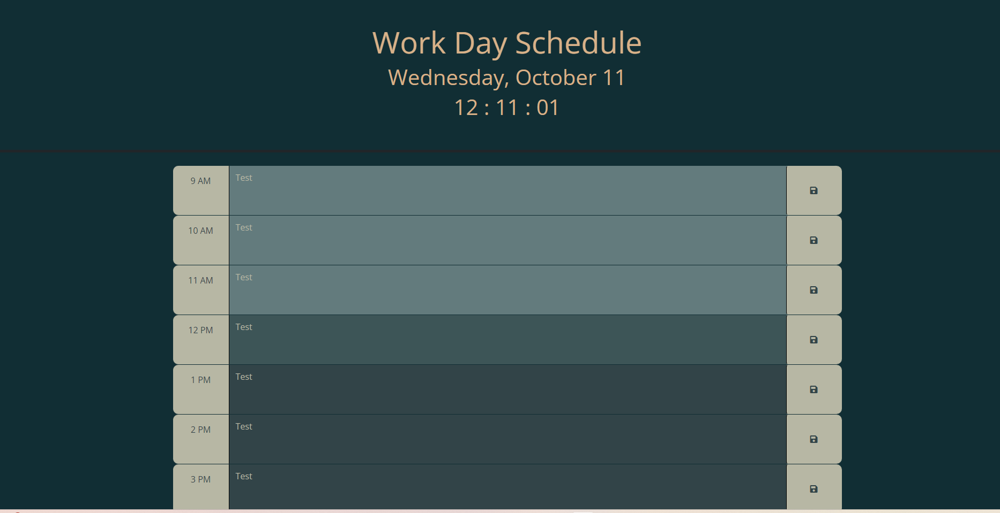

# Work Day Scheduler

## Description
A scheduler for the work day. Enter your tasks for the day in the corresponding block and click the save button.

## Installation
N/A

## Usage

Enter your tasks for the day in the corresponding block and click the save button. The light grey/green color is for past events, the medium green is for the present, dark green for the future.

=======

## Credits
Example code provided by Bootcamp lessons.

## License
MIT
